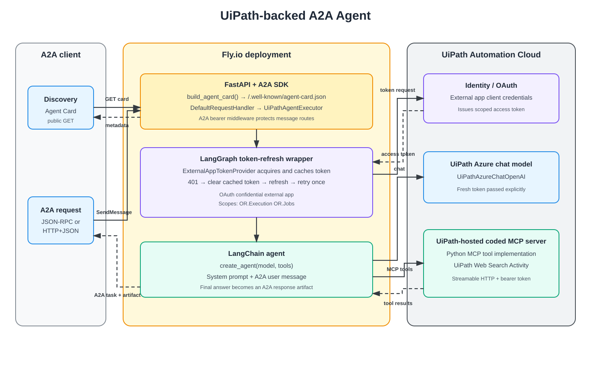

# a2a-uipath-agent

An HTTP-only A2A remote agent that runs on Fly.io and uses UiPath-hosted AI and automation services. The deployed hostname is intentionally not published here.

## What this project contains

- A FastAPI server exposing A2A 1.0 JSON-RPC and HTTP+JSON routes.
- A public A2A Agent Card for discovery.
- A `UiPathAgentExecutor` that maps A2A task lifecycle events to the agent invocation.
- A LangGraph wrapper that acquires, caches, and refreshes a UiPath OAuth access token.
- A LangChain agent created with `langchain.agents.create_agent`.
- A `UiPathAzureChatOpenAI` chat model served through UiPath.
- A streamable HTTP MCP connection to a UiPath-hosted coded MCP server. That server is a separate Python project and exposes a UiPath Web Search Activity as an MCP tool.
- Docker and Fly.io configuration for deployment.

The service is currently deployed on Fly.io. Clients discover it through the public Agent Card, while A2A message routes can be protected with a separate bearer token.

## Architecture



The editable source is [`docs/architecture.excalidraw`](docs/architecture.excalidraw).

For each request, the LangGraph wrapper obtains a token using a confidential UiPath OAuth external app. The external app must be granted these scopes:

```text
OR.Execution OR.Jobs
```

The same fresh access token is passed explicitly to both the UiPath Azure chat model and the streamable HTTP MCP connection. If either returns HTTP 401, LangGraph clears the cached token, refreshes it, and retries once.

## Agent Card

`build_agent_card()` constructs an `AgentCard` with the agent name, provider, version, capabilities, web-search skill, and supported interfaces. `build_app()` publishes that card at:

```text
/.well-known/agent-card.json
```

The card advertises JSON-RPC at `/a2a/jsonrpc` and HTTP+JSON at `/a2a/rest`. In Fly.io, `A2A_PUBLIC_URL` supplies the public base URL so the card does not advertise the container's internal host and port. Agent Card discovery remains public; when `A2A_BEARER_TOKEN` is set, the A2A message routes require `Authorization: Bearer <token>`.

## Run locally

This project uses `uv` for Python dependencies.

```bash
uv sync

export UIPATH_CLIENT_ID="<external-app-client-id>"
export UIPATH_CLIENT_SECRET="<external-app-client-secret>"
export UIPATH_URL="<uipath-tenant-base-url>"
export UIPATH_OAUTH_SCOPE="OR.Execution OR.Jobs"
export UIPATH_MCP_SERVER_URL="<uipath-hosted-coded-mcp-url>"
export A2A_BEARER_TOKEN="<token-clients-must-send>"

uv run server.py
```

The external app also needs access to the UiPath folder that hosts the coded MCP server. The configured MCP URL and its Web Search connection are tenant-specific.

Fetch the Agent Card and send a message:

```bash
curl http://127.0.0.1:9999/.well-known/agent-card.json

curl -X POST http://127.0.0.1:9999/a2a/jsonrpc \
  -H 'Content-Type: application/json' \
  -H 'A2A-Version: 1.0' \
  -H "Authorization: Bearer $A2A_BEARER_TOKEN" \
  -d '{"jsonrpc":"2.0","id":"1","method":"SendMessage","params":{"message":{"messageId":"m1","role":"ROLE_USER","parts":[{"text":"Find the latest UiPath agent news"}]}}}'
```

## Deploy your own copy to Fly.io

Prerequisites:

- A Fly.io account and `flyctl` authenticated with `flyctl auth login`.
- A confidential UiPath OAuth external app with the scopes `OR.Execution OR.Jobs`.
- The external app's client ID and client secret.
- A UiPath-hosted coded MCP server URL. For this example, that separate Python MCP server implements a UiPath Web Search Activity.

1. Clone the repository and create a Fly app:

   ```bash
   git clone <repository-url>
   cd a2a-uipath-agent
   flyctl apps create <fly-app-name>
   ```

2. Update `fly.toml`:

   - Set `app` to your Fly app name.
   - Set `A2A_PUBLIC_URL` to `https://<fly-app-name>.fly.dev`.
   - Set `UIPATH_BASE_URL` to your UiPath tenant base URL.
   - Set `UIPATH_MCP_SERVER_URL` to your hosted coded MCP endpoint.
   - Keep `UIPATH_OAUTH_SCOPE` as `OR.Execution OR.Jobs` unless your implementation requires additional scopes.
   - Optionally change `UIPATH_AGENT_MODEL`, region, or VM size.

3. Generate an independent token for callers of the A2A routes, then store secrets in Fly:

   ```bash
   export A2A_BEARER_TOKEN="$(openssl rand -hex 32)"

   flyctl secrets set \
     UIPATH_CLIENT_ID="<external-app-client-id>" \
     UIPATH_CLIENT_SECRET="<external-app-client-secret>" \
     A2A_BEARER_TOKEN="$A2A_BEARER_TOKEN" \
     --app <fly-app-name>
   ```

4. Deploy and inspect the public Agent Card:

   ```bash
   flyctl deploy --app <fly-app-name>
   curl https://<fly-app-name>.fly.dev/.well-known/agent-card.json
   ```

5. Send an authenticated request to the advertised JSON-RPC or HTTP+JSON interface using the generated A2A bearer token.

Do not commit OAuth secrets or the A2A bearer token. See [`WALKTHROUGH.md`](WALKTHROUGH.md) for a closer look at the request lifecycle and token-refresh graph.
